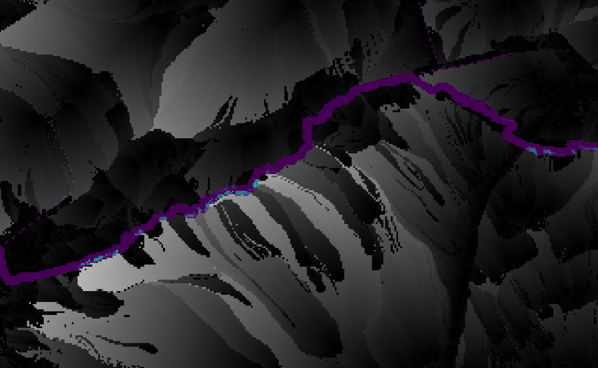

# Raster Nomograph calculation
Calculate recommended riparian strip width pixel-wise across based on DEM and soiltype

Nomograph by Mander and Kuusemets 1998

buffer zone effect from nomgraph in protection zone

