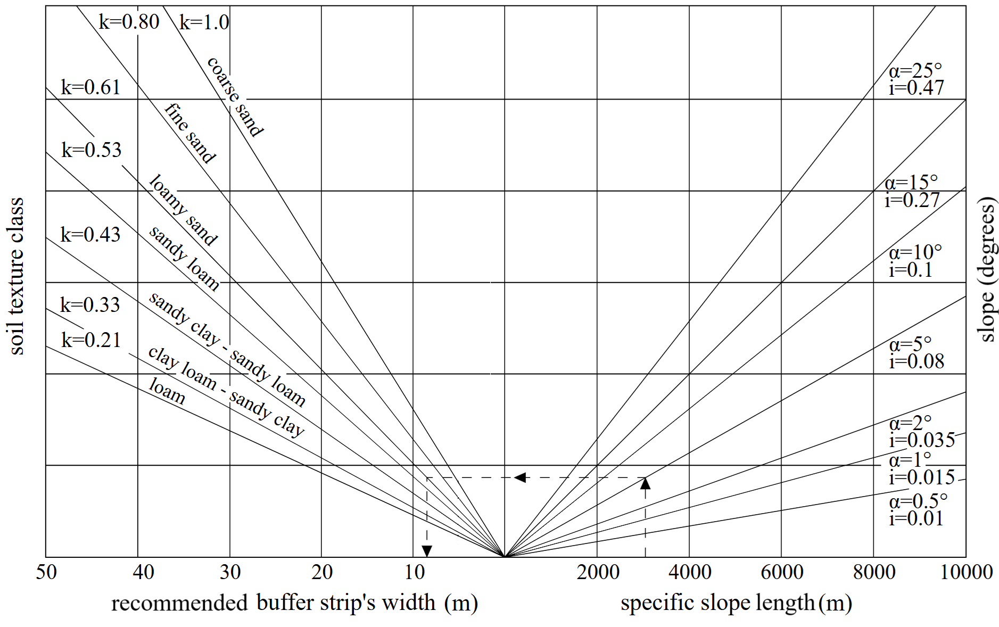

# Calculation of recommended riparian buffer strip width based on nomograph

The repository consists of scripts that enable calculating recommended riparian buffer strip widths based on elevation and soil data. The calculations are based on nomograph developed by Mander and Kuusemets (1998).

Nomograph by Mander and Kuusemets 1998

## Nomograph impementation

- buff_width_calc_vectorized_v4.py - nomograph implementation in Python
- NomographProcessingAlgorithmV4.py - nomograph implementation in Python as QGIS Processing algorithm plugin

## Uncertainty analysis

- uncertainty_analysis.jpynb - script to perform correlation analysis between all the input layers of the nomograph to indirectly measure the sensitivity of the  final output (buffer width) to the inputs.

## Buffer statistics

- topo_stats.ipynb - script that calculates some statistics (e.g. min, max etc) of the resulting buffer strip witdh for the processing tiles

- final_buf_stats.ipynb - script to calculate the histogram of vectorised buffer widths of natural water bodies and drainage ditches

- final_buf_vegetation_stats.ipynb - Ssript to calculate the proportion of vegetation cover and arable land in the buffer strips.

## References

Mander, Ü., Kuusemets, V., 1998. Mander, Ü. and Kuusemets, V. 1998. Non-point pollution control by riparian buffer strips: Dimensioning and efficiency assessment., in: Proceedings of the 3rd International Conference on Diffuse Pollution. Edingurh, pp. 136–143

## Usage

The software is available under a MIT license. Please refer to the Zenodo DOI and the published paper when using it.
